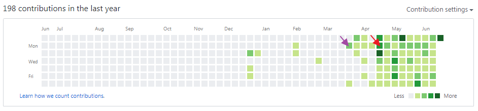
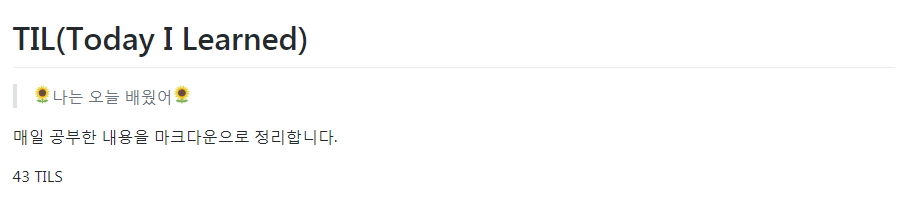

# 바닐라코딩 수강 후기

바닐라코딩 프렙 코스의 후기 입니다.
이 후기는 바닐라코딩을 고민을 하는 분들의 궁금증 해소를 위하여 쓴 글입니다.

## 상담가기 전까지

**이 내용은 스킵 하셔도 무방 합니다**.

그때의 나는 퍼블리셔로 에이전시에 근무 중이었다. 자바스크립트가 재밌어서 퇴근 후 조금씩 이론 공부를 하였는데 이게 티끌이다 보니 모아도 모아도 **티끌**이더라. 특히 내가 다니던 에이전시는 모두가 jQuery로 업무를 하다 보니 Vanilla JS 를 파도 실무에 쓸 일이 거의 없었다. 협업하는 와중에 나혼자 Vanilla JS로 작성하는건 말도 안된다. 이러한 문제로 퇴사 후 본격적으로 해보자! 생각이 들었다.

그 당시 2가지 고민이 있었다.

* 언제 퇴사할 것인가?
* 어떻게 공부할 것인가?

**언제 퇴사할 것인가?**

문제는 내일채움 공제가 끝나는 4월 말이냐? 정확히 경력 n년으로 채우냐의 문제였다.
이 문제에 대해 직장동료와 고민상담 하는 와중에

> 부양가족 없을 때 지르세요.

라는 명쾌한 말에 4월 말로 땅땅 결정하였다.

**어떻게 공부할 것인가?**

이 문제는 프론트엔드 개발자를 꿈꾸면서 스터디를 그동안 총 4개를 했었다.
회사에서 소소하게 주1 회 공부하는 게 목표였던 대리 + 사원급 스터디 외에 3개는 외부 스터디였는데.. 외부 스터디(유료포함)가 하나도 만족스럽지 않았다. 그래서 4번째 스터디에서 좌절을 느끼고 쭉 혼자 소소하게(티끌 모아 티끌..) 공부하였다. 

그래서 퇴사 후에도 혼자 공부할 생각이었는데 *혼자 자극 없이 꾸준히 할 수 있을까?*와 *공부를 언제까지 할 것이며 스스로 취업 시기를 정할 수 있냐* 가 고민이 있었다. 

그러다 지인(이라 하고 생명의 은인)의 상담 후기와 추천을 듣고 바닐라코딩 구글링을 엄청나게 하고 상담받으러 갔다.

## 상담 후기

상담은 나에게 2가지 충격을 줬다.

* 공부법이 매우 잘못된 것
* 알고리즘의 중요성

**공부법**
은.. 상담 중간에 KEN님이 1줄 코드를 쓰고 질문을 하셨다. '이 값은 무엇일까요?' 하고 질문 하셨는데 책에서 보긴 봤지만 한 번도 써본 적은 없었다. 그러니 답은 꽝.. 지금까지 이론만 조금씩 파고 실제 만들어보지 않았으니 매우 문제가 컸던 거다. 나는 내가 생각한 거보다 더 무지했다. 

**알고리즘의 중요성**
결국 중요한 건 문제 해결 능력이었다.
하지만 한. 번. 도. 알고리즘을 풀어본 적이 없다. 왜 알고리즘을 해볼 생각을 못 했던가? 후회되었다. 1주일에 1개만 풀어도.. 몇 개였는지.. 매우 후회되었다.

바닐라코딩은 상담 후 적어도 1주일 후에 등록 가능한데, 그때 알찬 상담으로 흥분한 나는 '지금 등록하겠다!'고 말 안듣다가 KEN님의 당황한 눈초리를 보고 정신차렸다. 1주일동안 알고리즘 가장 쉬운 난이도 12개를 풀고 프렙 코스를 등록하였다.

## 프렙 후기

### 가장 좋았던 점

* 강의
* 과제
* 매우 꼼꼼한 코드 리뷰

**강의**
강의는 매우 알차고 무조건 떠먹이는 게 아니라 이론 공부를 하면 return 값이 무엇인지 퀴즈 풀기를 한다. 이 퀴즈를 같이 풀면서 내가 제대로 이해했는지 한 번 더 생각하게 된다. 이 퀴즈들은 복습할 때도 매우 유용하여 다시 풀기에 매우 좋다. 
수업 중 primitive와 reference 설명,  prototype 설명은 참 센세이션 하면서 매우 이해가 잘 되도록 우리 입장에서 설명해준다. 너무 친절한 설명에 기억에 매우 남는다. 또 garbage collection의 찰떡같은 비유는 최고였다. 자바스크립트를 탄탄하게 기초부터 쌓아주신다. 내가 복습만 잘 하면 된다. 정말. 

**과제**
처음엔 이 과제를 어찌해.. 나 한 번도 안 해봤어.. 이런 상태였다. 근데 이게 무슨 일? 지금 마지막 과제까지 다 제출 했다. 믿기지가 않는다. 만약 혼자 공부했다면 2달동안 플젝 1~2개 밖에 못하지 않았을까 한다. jquery만 짜던 내가 이렇게 여러개의 과제를 했다는 거 자체가 믿기지 않는다. 

**코드리뷰**
이점은 내가 회사 다닐 때부터 매우 필요했던 거였다. 
정말 누가 좀 내 코드를 보고 피드백을 하길 바랐는데, 바코에서 코드 리뷰를 받을 수 있어 정말 행복했다.
정말 한 줄 한 줄 꼼꼼히 봐주셔서 나도 점차 한 줄 한 줄 더 따지면서 쓸 수 있게 되었다. 
변수명, 함수명을 더 고민하고 조건식도 이게 최선인지 또 생각해 본다. 세미콜론도 올바른 곳에서 쓰는 법도 배우고 코드 리뷰 덕에 기준이 많이 생기게 되었다.
공부를 하는 이유도 결국 코드 한 줄을 위해서였기 때문에 매우 소중한 기회였다. 

그 외에 바코는 슬랙을 쓴다. 나도 이직한 직장동료에게 들은 슬랙을 써보고 싶었는데 기회가 생겨 좋았다. 수업이 있는 날엔 일찍 가서 공부도 할 수 있고, BGM도 틀어져 있고.. 플레이리스트도 매우좋고.. 다들 친절하시당! 

### 변화

2달 과정이었지만 여러 가지 변화가 있었다. 
프렙 코스는 주 2회 수업이기 때문에 5일은 내가 스스로 공부해야 한다. 길잡이는 바닐라코딩이 되어주고, 또 수강생분들 모두가 매우! 열심히 하기 때문에 자극받아 5일을 더욱 알차게 보내게 된다.

* 알고리즘 시작
* 일일 커밋
* TIL 시작과 43 TIL 작성

**알고리즘 시작**
한번도 알고리즘을 하지 않았던 내가 알고리즘을 시작했다는 건 큰 변화다. 과제 외에 또 다른 재미를 느낄 수 있다. 특히 es6 문법과 메소드 사용을 익히는데 매우 도움이 되었다. 상황에 따라 메소드를 엄청 찾아보게되고, 또 솔루션을 해결했을 때 다른 이용자들의 코드를 보며 또 한 번 배우게 된다. 6월부터 다시 최소 주 5회를 목표로 하는 중이다.

**일일 커밋**
깃허브에서 일일 커밋을 한번 해보고 싶었다. 하지만 뭘 올려야 할지도 모르겠고 꾸준히 하기 힘들었는데, 바코와 함께 시작하게 되었다. 바코가 길잡이가 되어주면서 올릴게 너무너무 많다! (공부할 것들이 너무 많다. :joy: )

보라색이 바코 상담한 날이다. 저 날 알고리즘 repository를 새로 팠는데 회사랑 병행하다 보니 꾸준히 하지 못하였다. 그리고 빨간색이 바코 프렙 시작일이다. 

**TIL 시작**
빨간색 화살표가 있던 아마 전날쯤 바코 슬랙에 5기 캠프를 수료하신 분의 TIL이 올라왔었는데, TIL이 있는지도 몰랐다. 
그리고 매일매일 작성하신 TIL을 보고 자극받아서 나도 repository를 만들었고 현재도 꾸준히 올리는 중이다. 바코에선 이런 자극이 꾸준히 있어 발전을 안 할 수 없다. 이전에 나는 markdown으로 글을 써본 적이 없다.

현재는 총 43개의 TIL이 작성되었고 총 8주 중 2주의 수업이 남아있다. 'ㅁ'/ 예~

**단점**
이라고 소박하게 말하면.. 이전의 취미를 잃고 코딩이 취미이자 매일의 일과가 된다.
매우 TMI로 나는 본래 방탈출 하기와 외국 드라마 보는 걸 좋아한다. 방탈출은 총 50회 경험이 있고(..방탈출만큼 알고리즘을 했..크읍) 외국 드라마는 왕좌의게임.. 오뉴블.. 웬트워스.. 기묘한 이야기.. 블랙미러 등등 보았는데 약 2년간 기다린 왕좌의  게임 새 시즌은 현재 보지도 못했고 방탈출도 최근 하지 못했다. 

하지만 이 일들이 내가 억지로 참은 게 아니라 매우 자연스럽게 일어났다. 코딩을 하다 보니 이런 시간이 아예 없어진 거다. 지금이 훨씬 더 만족스럽다.

**마무리**
아마 나같이 퍼블리셔에서 프론트엔드를 꿈꾸며 업무 중간중간마다 *"아~ 하루 종일 자바스크립트만 만지는 일 하고 싶다~"* 하시는 분들 계실 거다. 여기서는 그 꿈에 다가갈 수 있도록 도와준다. jQuery만 쓰던 내가 바코와 함께 하루 종일 Vanilla JS 만지는 일이 매일매일 일어난다. :relaxed: