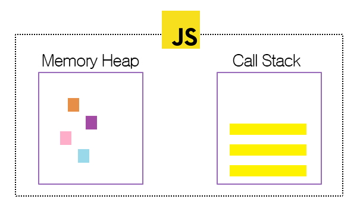

# 이벤트 루프(event loop)가 대체 뭐야?
What the heck is the event loop anyway? | **Philip Roberts** | JSConf EU 
[youtube 영상 보러가기](https://www.youtube.com/watch?v=8aGhZQkoFbQ) 를 통해 배운 내용을 정리
**매우강추**


## JavaScript

> **A single-threaded non-blocking asynchronous concurrent language.**
> 싱글 스레드 논 블록킹 비동기 동적 언어

> JavaScript has **Call stack**, an **event loop**, a **callback queue** some other **apis** and stuff

여기에 있는 단어들을 하나씩 파악해 보자! 

* 싱글 스레드
* 블로킹
* 비동기
* call stack 
* event loop
* callback queue
* apis

*event loop를 위해.. 알아야 할게 참 많구나.*

## 싱글 스레드

하나의 프로그램은 동시에 **하나의 코드만 실행**할 수 있다. 
자바스크립트는 싱글 스레드 런타임을 가지고 있어, 결국 **한번에 하나의 싱글 콜 스택만**을 가지고 있다. 
자바스크립트는 싱글스레드다. 

## blocking

느리게 동작하는 코드, 주로 느린 동작이 스택에 남아있는 경우를 말한다.
자바스크립트는 논-블로킹이다. 


## 동기 vs 비동기 (synchronous vs asynchronous)


상단에 있는 그래프가 동기 / 아래가 비동기다.
동기는 오직 한가지 일만 처리하며 마냥 끝날때까지 기다려야 한다.

# 자바스크립트 엔진 - 크롬 V8


웹 브라우저를 만드는 데 기반을 제공하는 오픈 소스 자바스크립트 엔진이다.(위키백과참조)
크롬과 node.js에서 사용된다. 


## 런타임 (runtime)

프로그램이 실행되고 있을 때 존재하는 곳을 말한다. 이 이미지는 **V8의 런타임을 시각화** 한 것이다.



### V8의 런타임 - Memory Heap 과 Call Stack

* **Memory Heap**: 메모리 할당이 이루어지는 곳(자료구조 heap이랑은 다르다.)

* **Call Stack**: 코드가 실행되면 스택 프레임이 쌓이는 곳

> V8 소스에는 setTimeout 이나 DOM, HTTP 요청을 관리하는 코드들은 찾아 볼 수 없다!
> 비동기 코딩에서 가장 먼저 떠오르는 것들이 없는거다.

## 브라우저


브라우저는 **Web APIs**(DOM, Ajax, timeout 등)와 **event loop**와 **callback queue**를 가지고 있다.


## 콜스택(Call Stack)

콜 스택은 데이터 스트럭처로 실행되는 순서를 기억하고 있다. 
함수를 실행하려면 스택에 해당하는 함수를 집어넣게 되는데 함수에서 리턴이 일어나면 스택의 가장 위쪽에서 해당 함수를 꺼내게 된다. 이게 콜스택!

## 콜백 큐(Callback Queue)

함수들이 줄서서 기다리는 공간이다. 

## Run To Completion

자바스크립트 성질. 
한번 실행되면 끝장을 본다. 

```js
console.log(1);

console.log(2);

setTimeout (function() {
  console.log(4);
  
  setTimeout(function() {
    console.log(6);
  }, 1000);
  
  console.log(5);
}, 1000);
console.log(3);
```

단계단계 끝장을 봐야 다음 순서가 실행될 수 있다. 

## 정확히 2초 후에 실행되는가?

```js
setTimeout(function() {
	alert(1);
},2000);
```
이런 함수가 있는데 스택 -> 콜백 큐로 가는 시간도 포함된다.

## Render Queue

보여질 작업들을 줄 세운다.

## Dom Construction

바이트로 먼저 받는다 -> 문자로 변경된다 -> token화 한다. 노드로 만들기 전처리 전 -> node(객체로 하나하나 만든다) -> 트리구조로 만든다.

DOM 트리 + CSSOM 트리 => Render Tree -> layout -> paint

**Records**

* layout
* paint - 실제로 픽셀을 채워가는.

