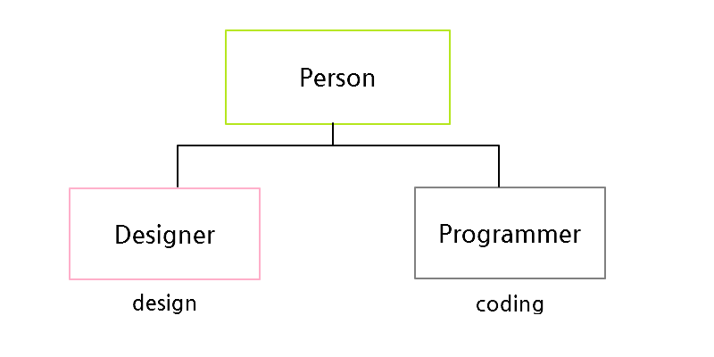

# 상속(Inheritance)

일단 먼저 객체는 프로퍼티와 메소드를 가지고 있고, 그 객체를 그대로 물려받아 새로운 객체를 만들 수 있고, 오리지널 객체(부모)의 프로퍼티와 메서드에 접근 할 수 있고,  새로만들어진 객체는 부모객체의 동일한 기능을 가지고 있다.

하지만, 이거외에 새로운 객체는 부모 객체를 필요한거는 유지하고 필요없는 건 제거할 수 있어야 한다. 그대로 상속하는건 의미가 없기 때문이다.

상속의 기본적인 동작 방법 -> 재활용성을 위해서이다.

예시1

```js
function Person(name){
    this.name = name;
    this.introduce = function(){
        return `My name is ${this.name}`;
    }
}
var p1 = new Person('sla');
console.log(p1.introduce()); //'My name is sla'
```

예시2

```js
function Person(name){
    this.name = name;
}
Person.prototype.name = null;
Person.prototype.introduce = function(){
    return `My name is ${this.name}`;
}
var p1 = new Person('sla');
console.log(p1.introduce()); //'My name is sla'
```

결과는 똑같다. 
예시1에서는 프로퍼티 세팅을 생성자를 통해서 하였다.
예시2는 Person이라는 함수의 약속된 프로퍼티 `prototype`을 사용하였다.  이렇게 하여 동일한 결과를 도출함.


## 상속의 사용방법

```js
function Person(name){
    this.name = name;
}

Person.prototype.name = null;
Person.prototype.introduce = function(){
    return `My name is ${this.name}`;
}

function Programmer(name){
    this.name = name;
}

Programmer.prototype = new Person();

var p1 = new Programmer('sla');
console.log(p1.introduce());
```

1. Programmer 앞에 new를 붙여서 생성자 -> 객체를 만들었다.

```js
var p1 = new Programmer('sla');
```

2. name에 'sla'가 담기고 결과 값이 p1 변수에 최종적으로 담긴다.

```js
function Programmer(name){
    this.name = name;
}
```

3. 상속은 어떻게 가능했던 것인가.

```js
Programmer.prototype = new Person();
```

prototype 이라는 특수한 프로퍼티로 new Person(); 을 하고 이렇게 하면 어떻게 되는가?
생성자에 의하여 어떠한 객체가 생성이 되는데 
그 객체를 생성할 때 자바스크립트는 생성자가 prototype을 가지고 있는지 체크하고 
`생성자 함수안에 있는 객체와 똑같은 객체를  만들어서 생성자의 결과로 리턴해준다.`

```js
Person.prototype.name = null;
Person.prototype.introduce = function(){
    return `My name is ${this.name}`;
}
```

name과 introduce는 prototype 안에 들어 있기 때문에,
new Person();을 통해 만든 객체는 name과 introduce를 가지고 있는 객체가 된다. 

```js
Programmer.prototype = new Person();
```

그럼 그 객체는 **prototype이라는 속성의 값이 된다.**

```js
function Programmer(name){
    this.name = name;
}
Programmer.prototype = new Person();
var p1 = new Programmer('sla');
```

 new Programmer를 해서 생성자를 객체화 하였는데 그럼 자바스크립트는 이 생성자 함수가 가진 prototype이라는 프로퍼티와 동일한 구조를 가지고 있는 동일한 객체를 만들어서 p1에 return 해준다.

다시 말하면,

```js
Programmer.prototype = new Person();
```

p1는 prototype이라는 생성자의 프로퍼티에 들어있는 객체와 같은데  그 객체는 new Person(); 이라는 생성자 함수가 만든 객체이고 그 객체가 가지고 있는 introduce도 가지고 있다.

### 어떠한 객체를 상속받고 싶다면 

```js
Programmer.prototype = new Person();
```

**그 객체를(new Person()) 생성자(Programmer)의 prptotype에 할당시키면 된다.**


## 기능의 추가

상속받은 새로운 객체에만 기능을 추가하고 오리지널 객체에는 영향을 받지 않게 하기

```js
function Person(name){
    this.name = name;
}
Person.prototype.name = null;
Person.prototype.introduce = function (){
    return `My name is ${this.name}`;
}

function Programmer(name){
    this.name = name;
}
Programmer.prototype = new Person();
Programmer.prototype.coding = function(){
    return "hello world";
}

var p1 = new Programmer('sla');
console.log(p1.introduce());
console.log(p1.coding());
```

```js
Programmer.prototype.coding = function(){
    return "hello world";
}
```

Programmer라는 생성자에만 coding이 추가 되었다. 


```js
function Person(name){
    this.name = name;
}
Person.prototype.name = null;
Person.prototype.introduce = function (){
    return `My name is ${this.name}`;
}

function Programmer(name){
    this.name = name;
}
Programmer.prototype = new Person();
Programmer.prototype.coding = function(){
    return "hello world";
}

function Designer(name){
    this.name = name;
}
Designer.prototype = new Person();
Designer.prototype.design = function(){
    return "beautiful!";
}

var p1 = new Programmer('sla');
console.log(p1.introduce());
console.log(p1.coding());

var p2 = new Designer('namhee');
console.log(p2.introduce());
console.log(p2.design());
```



Designer와 Programmer 생성자는 Person의 prototype이라는 프로퍼티 값을 이어 받고 또 Designer와 Programmer 만의 prototype.designer와 prototype.coding을 가지게 된다.