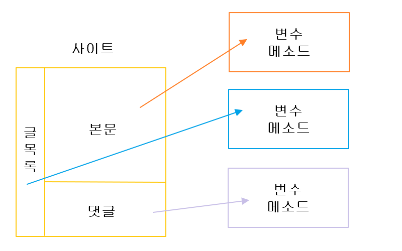

# 객체 지향 프로그래밍

* Object Oriented Programming
* OOP
* 상태(state)와 행위(behave)를 그룹핑 해놓은 것
* 객체와 객체를 조합해서 하나의 프로그램을 만드는 것을 객체 지향 프로그래밍

## 필요한 이유

* 사이트의 규모가 큰 경우 기능별로 묶고 싶을 때 
* 카테고라이징 / 그룹핑
  * 이처럼 글목록의 기능 따로 본문기능 따로 댓글 기능 따로 기능별로 그룹핑이 필요한 큰 프로젝트에서 유용하다.

* 다른 프로젝트에서도 다른곳에서도 사용할 수 있다 -> 재활용성

### 추상화

> 복잡한 상황을 소프트화해서 단순화 시키는 과정 

문법을 숙지 하는것 보다 설계가 더 어렵다.

### 부품화

옛날 컴퓨터는 키보드와 모니터가 한몸이였다.
그러나 지금은 ? 키보드 따로 모니터따로 마우스 따로이다. 하지만 또 아이맥은 모니터와 본체가 한몸이다. 부품화는 정답이 없다. 

> 메소드는 부품화의 예이다. 프로그램이 커지면서 메소드가 많아지고 관리하기 힘들어졌는데 이로인해 객체지향 프로그래밍이 필요한 이유다. 
> 연관된 것들을 묶고 연관되지 않은 것은 묶지 않는 것

#### 은닉화(Information Hiding), 캡슐화(Encapsulation)

그것이 어떻게 만들었는지 모르는 사람도 사용할 수 있어야 한다.
내부의 동작 방법을 단단한 케이스 안에 숨기고, 사용자에게는 그 부품의 사용방법만을 노출 하는것 

#### 인터페이스

잘 만들어진 부품이라면 부품과 부품은 서로 교환 할 수 있어야 한다. 

