# Prototypes in Javascript

자바스크립트 세계의 가족 관계도를 알아보겠다. 👨‍👩‍👧‍👦 (오잉?)

키워드는 

* prototype (아빠)
* constructor (엄마)
* instance (자식)

이 될 것이다.

## Prototype

이라는 단어가 뜻하는 의미는 `원초적인 형태` , `원래의형태`를 말한다.

<br>

## Constructor

**생성자함수**
 new 키워드와 함께 쓰이는 함수를 말한다.

<br>

you don't konw js 책에서의 정의도 찾아보자

>자바스크립트의 생성자는 앞에 new 연산자가 있을 때 호출되는 일반 함수에 불과하다. 클래스에 붙은 것도 아니고 클래스 인스턴스화 기능도 없다. 심지어 특별한 형태의 함수도 아니다. 단지 new를 사용하여 호출할 때 자동으로 붙들려 실행되는 그저 평범한 함수다.
>
>15.7.2 Number 생성자(ES5.1명세)
>new 표현식의 일부로 호출 시 Number는 생성자이며 새로 만들어진 객체를 초기화한다.
>
>new를 붙여서 호출 할 수 있고 이는 결국 `생성자 호출`이나 다름없다. 생성자 함수가 아니라 `함수를 생성하는 호출`이라고 해야 옳다.

여기서 주목하게 되는 키워드들이 있다. 새로 만들어진 객체를 `초기화`한다와 `함수를 생성하는 호출` 이해가 잘 되는 키워드다!

<br>

또한 추가로 **new를 붙여 생성자 호출을 하면 어떤 일이 일어나는지** 간략하게 알아보자.

* 새 객체가 툭 만들어진다.
* 새로 생성된 객체의 [[Prototype]]이 연결된다.
* 새로 생성된 객체는 해당 함수 호출시 this로 바인딩 된다.
* 이 함수가 자신의 또 다른 객체를 반환하지 않는 한 new와 함께 호출된 함수는 자동으로 새로 생성된 객체를 반환한다.

<br>

**new 키워드와 함께 쓰이는 함수**

* new Array(); - 여기서 생성자 함수는 Array(); 이다. 
* new Object();
* new Function();

특징이 있는데 함수명의 첫글자는 대문자를 쓴다.

우리가 지금 까지 이렇게 직접적으로 쓰지 않았어도 우회해서 사용했을 것이다. 

<br>

**모든 자바스크립트 객체는 생성자 함수를 통해서 만들어 진것이다!**

```js
var arr = [];
varr arr = new Array(); // 사실상 똑같은 것이다.
```

또한 생성자 함수도 함수이고 -> 함수도 객체이다. 그래서 생성자함수도 -> 객체이다.
함수인데 객체이다? 이것이 무슨뜻이냐하면 `생성자 함수가 객체의 특징을 가질 수 있다`는 것이다.
그 특징이 무엇인지 알아보자.

**객체의 특징**
key와 value로 이루어져 있다.
`생성자 함수도 Key와 value를 가질 수 있다.`
생성자 함수인 Array() , Object(), Function()도 key와 value를 가질 수 있다.

하지만 이러한 Array(), Object(), Function()은 공통적으로 쓰이는것이기 때문에 따로 key와 value는 만들지 않는게 좋다.

또한 **생성자 함수는 원하면 우리가 만들 수 있다.**
**생성자 함수인지에 대한 정확한 판단은 쓰임에 따라 맞냐 아니냐로 나뉠 수 있다.** 

이제 함수와 prototype의 관계를 알아보자.

<br>

### 함수와 prototype의 관계 - 모든 함수는 prototype 속성이 있다!

---

함수를 만들면 무조건 prototype이라는 속성이 껴있다. 

```js
function foo () {
	return 3;
}
//모든 함수에는 prototype이라는 속성을 가지고 있다!
console.log(foo.prototype); // {constructor: ƒ} 

function Foo () {
	return 3;
}
//모든 함수에는 prototype이라는 속성을 가지고 있다!
console.log(Foo.prototype); // {constructor: ƒ} 
```

콘솔에 직접 찍어본다면 생성자 함수가 맞던 아니던 `함수명.prototype`으로 찍어보면 함수는 prototype이라는 속성을 가지고 있고 값으로는 `{constructor: ƒ} `를 확인 할 수 있다.

prototype에 해당되는 value는 객체임을 확인 할 수 있다.
의사 코드로 설명한다면 `Foo = { prototype: {} }`로 생각할 수 있다.

<br>

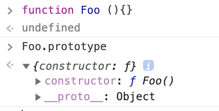
prototype의 value로 `{}`객체를 가지고 있으며,
그 객체들은 자동적으로 key와 value가 설정되어져 있다. 또한 constructor의 value는 자기자신 Foo()로 설정되어 있는 것을 확인 할 수 있다. 

<br>

**Construct는 .prototype 속성을 가지고 .prototype은 Prototype이라고 불리는 객체를 가지고 있다.**

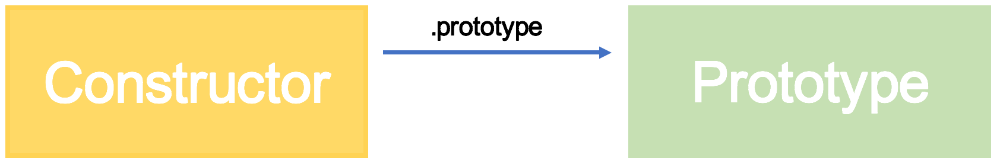
* 생성자 함수를 만들었다!(모든함수 다 포함이 가능하다)
* 생성자 함수는 자동으로 `prototype`이라는 속성을 가지게 된다.
* 이 `prototype 속성`이 갖고 있는 value는 어떤 하나의 `prototype이라는 부르는 객체`이다.

<br>

**Prototype이라고 불리는 객체에는 항상 반드시 .construct라는 속성을 가진다.**

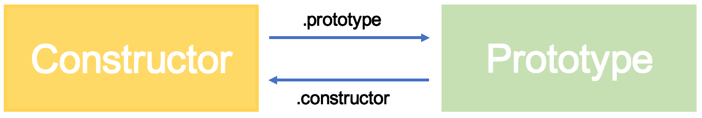

<br>

**console로 확인해보자**

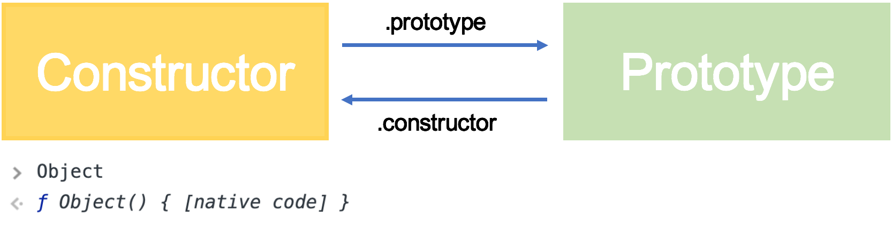
* Object라는 생성자 함수가 있다.

<br>

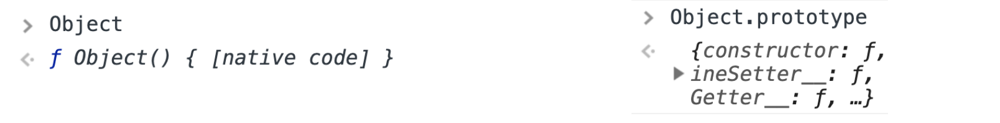
* 이 Object라는 생성자 함수에는 .prototype이라는 속성을 가지고 있고 이 .prototype은 Prototype이라는 객체를 가지고 있다.

<br>

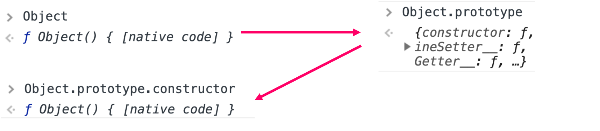
* prototype이라는 객체에는 constructor라는 속성이 있는데 그 속성은 생성자함수를 가리킨다.

<br>

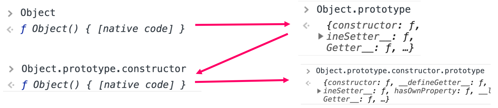
* constuctor속성은 constructor를 가리킨다. 
* construct는 또 prototype이라는 속성을 가진다. 

<br>
**정리하자면**

* Constructor는 .prototye이라는 속성을 가진다.
* .prototype속성은 Prototype이라는 객체를 가진다. 
* Prototype객체는 .constructor라는 속성을 가지게 된다.
* .constructor라는 속성은 Constructor를 가리키게 된다.
* Constructor는 다시 .prototype이라는 속성을 가지게 된다. 

**이로써 Constroctor와 Prototype은 .prototype과 .constructor 속성은 가지고 그 속성은 prototype이라는 객체와 Constructor를 가리키기 때문에 서로가 서로를 가리키게 된다.**

<br>

### 남편과 아내로 비유해 보자 💑

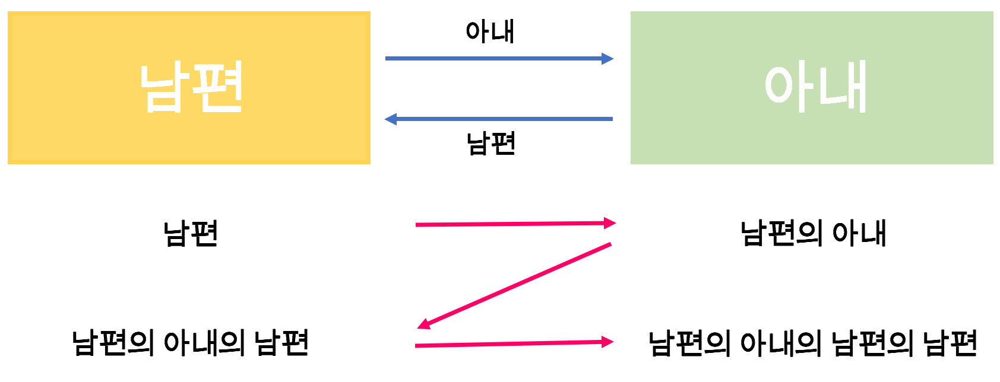

constructor가 남편이 되고 prototype은 아내가 된다.
그림과 같이 남편과 아내를 부르는 방법을 빨간 화살표대로 부를 수 있다고 생각하면 좀더 쉽다!

> 🌟실제로 작업을 할 때엔 쓰진 않는다.

<br>

## Instance 👨‍👩‍👧‍👦

(한가지의) 경우

```js
var obj = new Object();
```

new를 통해 생성자함수를 호출 하면 객체를 리턴해준다.
생성자함수는 무조건 this를 return해주고 this는 객체이다.

`new Object()를 한 결과물을 인스턴스라고 부른다.` 두둥

<br>

```js
function Foo() {}
var k = new Foo();
```

`new Foo();`라는 것은 인스턴스를 만드는 것인데 이것은 `Foo의 인스턴스`라고 말한다.

<br>

```js
var a = new Array();
var b = new Array();

var a = [];
var b = [];

console.log(a === b) // false
```

위에 두줄이 똑같다고 말 할 수있다.
하지만 a와 b는 같다고 할 수 없다.

<br>

방금전 남편과 아내에 비유를 하였는데 instance는 남편과 아내의 결과물이라고 생각해보자. 

```js
var obj = new Object();
```

* 여기서 남편은? Object가 된다.
* 여기서 아내는? Object.prtotype이 된다.

```js
function Foo() {}

var f = new Foo();
```

* f는 애기다.
* Foo가 아빠가 된다.
* Foo.prtotype이 엄마가 된다.

<br>

## Prototype chain! 👩‍👧

```js
var obj = {};
```

* 남편
  * 
* 남편의 아내
  *  
* **근데 자식이? constructor를 사용 할 수 있다?**
  * 

.constructor는 엄마 즉 Prototype이 가지는 속성이 였다.

obj에겐 아무것도 할당하지 않았는데 constructor를 가질 수 없는 상황이다.

이게 무슨일이냐???!
자식이 엄마의 물건을 슬쩍한 상황이다.

**자식은 일단 자신이 가지고 있는지 확인한 후! 체크체크 -> 없다면 엄마껄 슬쩍 한다.**

<br>

```js
var obj = {};

Object.prototype.haha = 123; // 엄마에게 haha라는 속성을 설정해줬다.

console.log(obj.haha) // 123
```

obj에게 haha를 만들어 주지 않았는데! haha를 가짐!  👩‍👧

**인스턴스(자식)는 자신이 뭔가를 필요로 할 때 먼저 양심껏 자신이 가지고 있는지 확인 한 후 없다면 prototype(엄마)에서 찾는다.**

<br>

**그림으로 확인한다면**

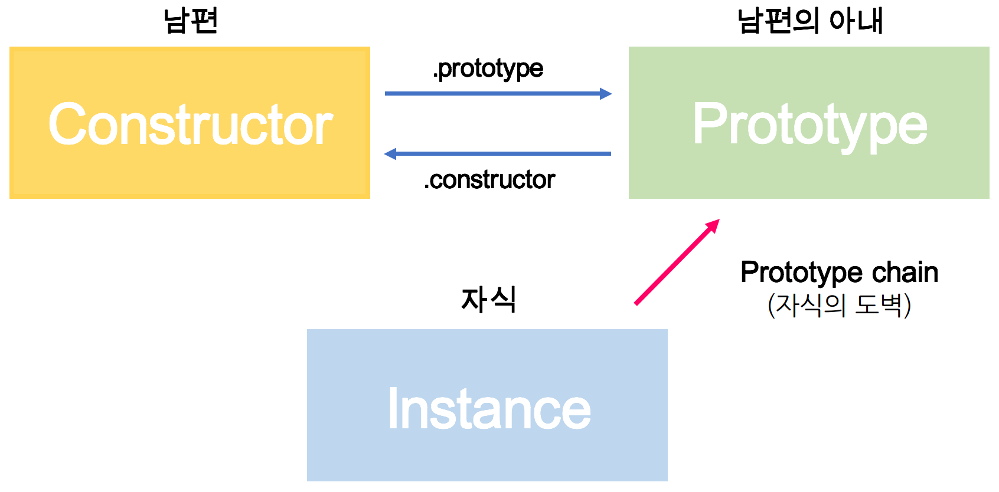

## Dunder Proto

__ proto __ 이렇게 생긴걸 Dunder Proto라고 한다.

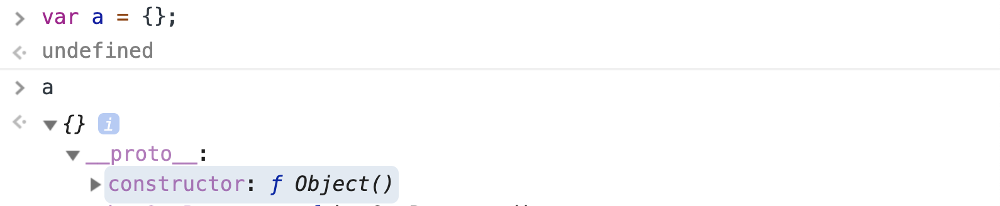
a 라는 instance를 생성후 a를 console에 찍어보면 {} 빈객체가 보인다.
그 안을 열어보면 Prototype(엄마)가 가지는 속성과 값이 있다! {constructior: Object}
엄마의 정보를 저장해 놓은 것이다. 

<br>

 ```js
function Person (name) {
  this.name = name;
}

// Person === 남편
// Person.prototype === 남편의 아내

// 아이 생성
var kennim = new Person('ken ken');

kennim.constructor === Person;
kennim.__proto__ === Person.prototype;
```
마지막 2줄을 자세히 살펴보자.

<br>

```js
kennim.constructor === Person;
```
kennim에는 constructor라는 속성이 없다. 그렇기 때문에 엄마인 prototype에서 살펴볼 것이고,
prototype은 .constructor라는걸 가지고 있다. 이 .construct는 아빠를 바라본다.
아빠는 Constructor고 그것은 Person이기 때문에 `true`다!

<br>

```js
kennim.__proto__ === Person.prototype;
```
아까 위에서 봤듯이 Dunder proto는 Prototype이 가진 정보를 가지고 있었다. 
그렇기 때문에 `true`

<br>

```js
var o = new Object();

o.costructor === Object();

o.constructor = function bar () {}

console.log(o.constructor === Object); // false;
```
`o 인스턴스` 자식이 가진 constructor를 가장 먼저 찾는데 그것은 bar function 이기 때문에 false가 된다.

<br>

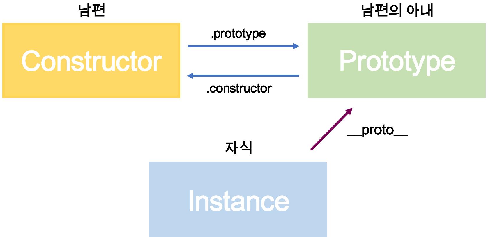 
* 자식이 엄마에게 접근하고자 할 때 Dunder proto로 할 수 있긴 하다. 하지만 하면 안된다.
* 저걸 쓰여야 하는 상황은 코드가 제대로 짜여있지 않다는 것이기 때문에 그 오류를 해결해야지 접근하면 안된다.

<br>

### 엄마아빠도 엄마아빠가 있다.

 ```js
function Foo () {} // 생성자함수 - 아빠

console.log(Foo.prototype); // 생성자함수.prototype - 엄마

console.log(typeof Foo.prototype) // 객체다. 객체가 어떻게 만들어 지는가? new Object() 이렇게다.

// Foo.prototype 얘 또한 누군가의 자식이란 말이다. 
```

<br>

Foo.prototype 얘의 엄마는 누굴까?**

`Foo.prototype` 또한 객체 instance다. key와 value를 가졌다.
아빠는 생성자 함수다 `Foo.prototype`의 아빠는 누구일까? 

<br>

얘에게도 엄마의 정보를 가진 `__proto__`가 있다.

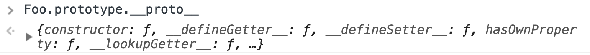
엄마의 정보가 나왔다.

<br>

잠깐 Object.prototype을 확인하자.

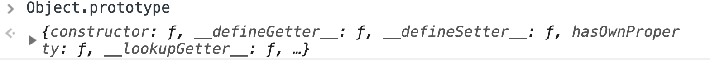
이 정보는 Foo.prototype. __ proto __ 와 Object.proto와 똑같다.

<br>

**이러한 이유는**
`Foo.prototype`도 `new Object();`로 만들어진 `하나의 intance`이기 때문이다.

<br>

### Foo.prototype.__proto__ === Object.prototype;

```js
Foo.prototype.__proto__ === Object.prototype; // true;
```

그렇기 때문에 엄마의 엄마의 정보인 Foo.prototype.__ proto __ 은 Object의 아내인 Object.prototype과 동일하다는 결과를 얻을 수 있다. 🤭

<br>

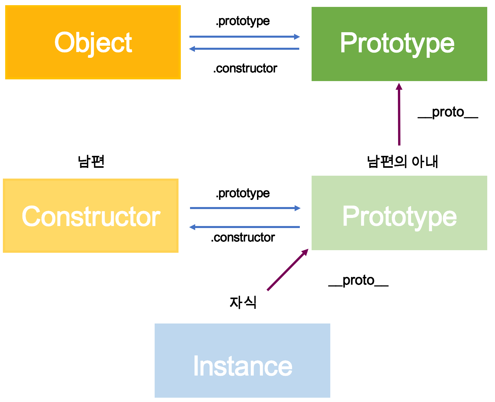
지금 접근한 상황을 그림으로 그리게 되면 이렇게 되는 것이다. (이것이 마지막 그림이길 빈다...)

* 남편은 Foo
* 남편의 아내는 Foo.prototype
* 남편의 아내의 엄마의 정보는 Foo.prototype.__ proto __ 로 접근
* 남편의 아내의 엄마는 실제 Object.prototype 이다. 워후 🤧

<br>

**그럼 Object의 아내의 엄마는 누굴까?**

```js
console.log(Object.prototype.__proto__) // null;
```

시스템상 null, Object의 아내는..쑥과 마늘을..먹...(..)

<br>

**가족관계를 직접확인해보자**

가족관계파악이 끝나니 다시 한번 확인하고자 하는 욕구가 생겼다.

```js
function Father() {}
var baby = new Father();

// __proto__를 이용해 엄마에게 접근
baby.__proto__ === Father.prototype; 

// 엄마(prototype)가 가진 constructor를 이용해 아빠에게 접근
baby.constructor === Father;

//__proto__ 로 할머니에게도 접근
baby.__proto__.__proto__ === Object.prototype;

//할머니가 맞는가?를 엄마로 체크해보면 false가 나온다.
baby.__proto__ === Object.prototype; 
```

<br>

**prototype chain은 최종 Object까지 올라간다**

```js
function Foo() {}
var f = new Foo();

Object.prototype.haha = 123;

console.log(f.haha); // 123
```

<br>

## Inheritance(상속)이 아니라 Behavior Delegation(행동을 위임, 대리)이다.

필요할 때마다 부탁을 하는것이지 상속 받은게 아니다.