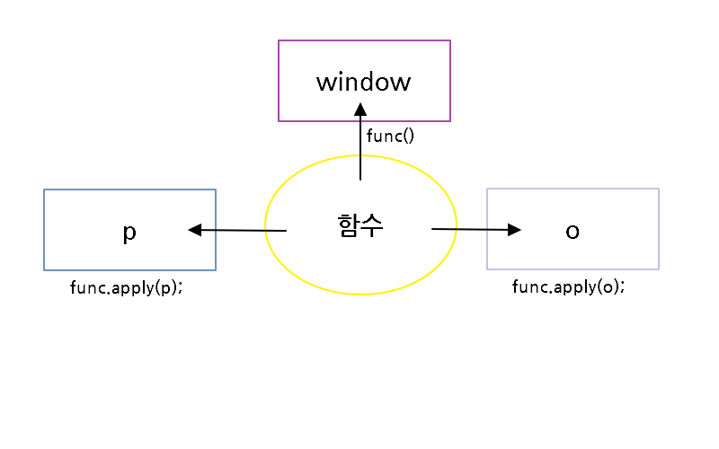

# this

this는 함수 내에서 호출 맥락(context, 가변적이다)을 의미한다.
this는 함수 안에서만 사용가능하며 약속된 변수이다.

> **함수가 어디에 소속되어 있는지가 중요하다**

## 함수에서의 this의 의미

첫번째예시

```js
function func(){
    if(window === this){
        return "window === this";
    }
}
console.log(func());
```

여기서 `this 는 윈도우다 `

### 메소드의 호출

두번째예시

```js
var o = {
    func: function(){
        if(o === this){
            return "o === this";
        }
    }
}
console.log(o.func());
```

o.func()의 this는 o를 가르킨다.

전역객체, 전역메소드는 window가 생략되어 있다. 
첫번째 예시의 this는메소드가 소속되어 있는 객체를 가리킨다.
두번째 예시는 o의 소속이기 때문에 o를 가리킨다.

그래서 함수의 호출과 메소드의 호출은 다른게 없다. 둘다 소속된 객체를 가리키고 있는데 생략되어 있는지 아닌지의 차이다.

## 생성자와 this

```js
var funcThis = null;

function Func(){
    funcThis = this;
}

var o1 = Func();
if(funcThis === window){
    console.log('window');
};

var o2 = new Func();
if(funcThis === o2){
    console.log('o2');
};
```

o1는 window.Func()가 생략된 것이므로 window 다

o2는 new를 붙여 Func();를 실행했기 때문에 자바스크립트는 내부적으로 비여있는 객체를 만들고 비여있는 객체가 생성자 안에서 this가 된다.

> 새로 생성되는 객체가 생성자 안에서 this가 된다.

#### new Func(); 가 다 실행된 후 var o2에 담긴다.

```js
var funcThis = null;

function Func(){
    if(o2 === this){
        funcThis = this;
    }
}
var o2 = new Func();
if(funcThis === o2){
    console.log('o2');
};
```

그렇기 때문에 Func()함수안에 if (o2 === this) .. 라고 바로 쓸 수 없다. 
func안에서 할경우 아직 o2라는 객체에 담기기 전에 실행되기 때문에 o2는 undefined가 된다.

객체에 대한 초기화가 끝난 후, 어떤 식별자에 담기기 전에 그 객체를 참고 할 수 있는 reference ??


```js
function Func(){
    this.area = function(){
    	if(o2 === this){
        	return 'o2 === this';
    	} 	   
    }
}
var o2 = new Func();
o2.area(); //'o2 === this';
```

하지만 이런식으로 했을 경우엔 'o2 === this'; 가 return 된다.

## apply와 this

#### 함수도 객체다

예시1 - sum이라는 함수객체 만들기 

```js
function sum(x,y){
    return x + y;
}
sum(1,2); //3
```

예시2 

```js
var sum2 = new Function('x','y','return x + y;');
sum(1,2); //3
```

new를 통해서 Function이라는 이름의 생성자 함수를 만든 것이다.
첫번째인자 x, 두번째인자 'y'는 파라미터(매개변수)를 의미하고 마지막 인자는 함수의 본문에 해당된다.

예시2처럼 작성하는것은 대단히 불편하다. 특히 예시2의 마지막 인자처럼 대단히 긴내용이면 더더욱 불편할 것이다.

예시1처럼 작성하면 자바스크립트 해석기가 함수 객체로 만들어 주는 것이다. ->함수 리터럴(Literal).

###### 리터럴(Literal)

```js
//객체 리터럴
var o = {}
//함수 리터럴
var arr = {}
```

new Object 나 new Array로 명시적으로 만들 수 있지만 리터럴 방식이라고 편리하게 만들 수 있게한다.

```js
var o = {};
var p = {};
function func(){
    switch(this){
        case o:
            console.log('o');
            break;
        case p:
            console.log('p');
            break;
        case window:
            console.log('window');
            break;
    }
}
func(); //'window'
func.apply(o); //'o'
func.apply(p); //'p'
```

func는 객체이기 때문에 프로퍼티와 메소드를 가질 수 있다.
apply의 첫번째 인자로  함수 호출 컨텍스트(context,맥락,가변적이다.)를 대입한다. 

전통적인 객체지향에서 메소드라는 것은 객체에 강하게 소속되어 있다.
하지만 자바스크립트는 유연하다.



apply를 이용해 호출 하니 함수 func()는 p의 메소드도 되고 o의 메소드도 됐다.
객체와 함수는 매우 대등하다. 왜냐면 함수도 객체이기 때문이다.
`함수를 어떻게 호출했냐`가 포인트다. 어떻게 호출했냐에 따라 어떤 객체에 종속되었는지가 달라진다.

> this는 변화무쌍하다.
> 함수가 어디에 소속되어 있는지가 중요하다.
> 자바스크립트는 유연하다.

