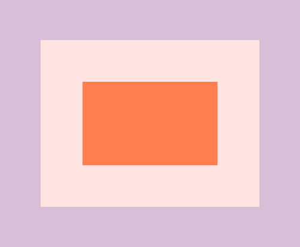

# Event Capture, Propagation, Bubbling and Once



```html
<div class="one">
    <div class="two">
        <div class="three"></div>
    </div>
</div>
```

이렇게 화면이 구성된 페이지가 있다.
one이 가장 바깥 안쪽으로 들어 갈수록 two - three로 구성되어 있다.

## Bubbling

```js
const divs = document.querySelectorAll('div');

function logText(e) {
  console.log(this.classList.value);
}

divs.forEach(div => div.addEventListener('click', logText));  

//div.two를 클릭할 경우 console창엔
//two
//one 

//div.three를 클릭할 경우
//three
//two
//one
```


**console.log를 this로 바꾸고 div.three를 클릭한다면?**

```js
const divs = document.querySelectorAll('div');

function logText(e) {
  console.log(this);
}

divs.forEach(div => div.addEventListener('click', logText));  

//console 창엔
//<div class="three"></div>
//<div class="two"></div>
//<div class="one"></div>
```

그럼 console 창에 차례대로 나온다.

**여러개가 내포된 요소를 클릭하는 경우 그의 부모요소 DOM까지 클릭 되는 현상을 볼 수 있다.**

## Capture

**javascript가 어떻게 일하는지 보자.**

1. modern browsers는 capture라고 불리는 것을 한다.
2. element를 클릭하면 그것은 위에서 아래로 흘러내린다. 
   * 브라우저는 "너 body도 클릭하고, one도 클릭하고 two도 클릭하고 three도 클릭했네" 하고 인식한다.
   * 실제로 위에서 아래로 내려가다가, 모든 이벤트를 내가 클릭한 곳에  "captures" 를 하고 보관한다. 
   * 하지만 이벤트는 실행되지 않는다.
   * 그럼 이제 클릭한 곳에서 "bubble Up"이 일어난다.

3. **그말은 즉 아래에서 위로 이벤트 트리거가 일어난다**.
4. 브라우저는 "좋아 우리가 알아낸 지금까지 너가 클릭한 모든 것들을 시작할께" 라고 말한다. 
5. three -> two -> one -> body 까지!

**addEventListener의 3번째 option을 사용하자**

```js
divs.forEach(div => div.addEventListener('click', logText, {
  //위에서 아래로 흐르는 기능을 사용한다는 거다.
  capture: true
}));  
```

false로 바꿔주자.

```js
divs.forEach(div => div.addEventListener('click', logText, {
  //위에서 아래로 흐르는 기능을 사용한다는 거다.
  capture: false
}));  
```

## Stop Propagation

또 한가지 **stop propagation**이라 불리는걸 해줘야 한다.

만약 가장 안쪽에 있는걸 클릭한다면, 이벤트가 **trigger** 된다. 
parent와 그것의 parent 모두가.

함수를 수정한다. 

```js
function logText(e) {
  console.log(this.classList.value);
  e.stopPropagation(); //stop bubbling! 
}
```

bubbling 해주는걸 멈추어 준다. 나는 사실 하나만 클릭했어 라는 뜻이 될 수 있다.'ㅁ'
그럼 내가 본래 원하던 하나를 클릭하게 된다! 

**capture: true and stopPropagation()**

```js
function logText(e) {
  console.log(this.classList.value);
  e.stopPropagation(); // stop bubbling!
  // console.log(this);
}

divs.forEach(div => div.addEventListener('click', logText, {
  capture: true
}));

//console에
//one만 뜬다.
```

왜냐면 capture가 내려갈 때 one에 도착했을 때 stopPropagation이 일어난다. 더이상 내려가지 못하는 것이다.'ㅁ'/

## Once

이벤트가 딱 한번만 일어나도록 해준다.

```js
function logText(e) {
    console.log(this.classList.value);
    // e.stopPropagation(); // stop bubbling!
    // console.log(this);
}

divs.forEach(div => div.addEventListener('click', logText, {
    capture: false,
    once: true
}));
```

once를 쓰면 이벤트가 실행되고 그것은 unbind가 된다.
unbind는 removeEventListener 로 생각하면 된다.

1. 이벤트가 실행되고 once로 인하여 
2. addEventListener는 unbind가 된다.

div요소 각 한번씩 이벤트가 실행될 수 있다.

**Example 2**

html

```html
<button></button>
```

js

```js
button.addEventListener('click', () => {
    console.log('Click!!!');
}, {
    once: true
});
```

이벤트는 정말 딱 한번만 실행된다!

[html파일보기](https://github.com/yami03/vanilla-js/blob/master/25%20-%20Event%20Capture%2C%20Propagation%2C%20Bubbling%20and%20Once/index-START.html)


