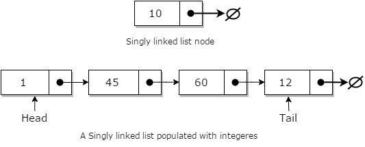

# Data Structures

자료를 다룰때 사용하는 특정형태 - 어떤 상황이 가장 적합한지 찾는다면 최적화된 코드를 짤 수 있다.
언어에 국한되지 않고 보장되어 있다.  

Big O를 항상 생각하고 코드에서 구분한다. 

* [stack](Stack-(Last-In First-Out))
* [Queue](Queue (First-In First-Out))
* [Linked List](Linked List 연결 리스트)
* [Tree](Tree)
* [Hash Table](Hash-Table)

<br>

## Stack (Last-In First-Out)


자료를 추가했다가 뺐다가 한다.
맨 마지막으로 들어간게 첫번째로 나온다. - Last-In First-Out 

* **Push**: 자료를 추가를 한다. 책을 쌓아가는 방식으로 하나하나 쌓인다고 생각하자
* **Pop**: 자료를 뺀다. - 쌓인 책이 쓰러지지 않도록 위에서부터 빼낸다.

<br>

### Big O

수학적인 표기법을 말한다.
Big O란 표기법의 하나로 시간,공간의 복잡도를 설명해준다. 

| Time Complexity | Big O    | 설명                                                         |
| --------------- | -------- | ------------------------------------------------------------ |
| **Insertion**   | **O(1)** | 괄호의 1은 상수를 말한다. 항상 1이다. <br/>시간적인 소요가 항상 같다. 올리면 끝, 그 외에 고려할 사항이 전혀없다. <br/>연산을 한 후 올리는게 아니다. <br/>올리는게 항상 동일한 시간이 소요된다. |
| **Deletion**    | **O(1)** | 제거하는거 외에 다른 사항은 고려할 필요가 없다.              |
| **Search**      | **O(n)** | n은 상황에 따라 다르다. stack의 사이즈.<br />어디에 있는지 알 수 없기 때문이다. |

<br>

### Real Life Use Cases

* 재귀함수
* Undo/Rodo Mechanism - 에디터를 사용했을 때를 예시로 들 수 있다.
* Backwards/Forwards Mechanism of Browsers
* Call Stack
* matching Brackets 알고리즘 - {}() 이런식의 짝이 맞는지에 대한 알고리즘

<br>

<br>

## Queue (First-In First-Out)


사람들이 줄서는거랑 비슷하다.

* **Enqueue**: 앞에서 부터 차례대로 쌓인다.
* **Dequeue**: 앞에서 부터 차례대로 빠진다. 

<br>

### Big O

변수가 없다.
알고리즘 복잡도를 표현한다. 어느정도 시간이 걸리는지, 공간을 따질때도 쓴다.

| Time Complexity | Big O    | 설명                                                         |
| --------------- | -------- | ------------------------------------------------------------ |
| **Insertion**   | **O(1)** | 변수가 없다.                                                 |
| **Deletion**    | **O(1)** | 중간에 있는걸 삭제한다 해도 찾는거랑 제거하는거랑 같이한다. <br />하지만 제거만 생각한다. |
| **Search**      | **O(n)** | n은 상황에 따라 다르다. stack의 사이즈                       |

<br>

 ### Real Life Use Case

* Life of people standing for food
* Callback queue

<br>

<br>

## Linked List 연결 리스트



[이미지 출처 - w3schools](https://www.w3schools.in/data-structures-tutorial/linked-list/)

* next를 인지하고 있다.
* **오직 내 뒤에 누가 있는지 인지 한다.**
* 스택큐는 인지하지 않는다.
* 맨 첫번째는 head고 맨 마지막은 tail이라 부른다.
* 배열과 다르다.
* 연결되어 있다.

<br>

### Big O
| Time Complexity | Big O    | 설명                                                        |
| --------------- | -------- | ----------------------------------------------------------- |
| **Insertion**   | **O(1)** | 어떤 자리에 꽂던 앞의 꼬리를 연결하고 뒤에 꼬리를 연결한다. |
| **Deletion**    | **O(1)** | 삭제한 후 앞의 꼬리와 뒤의 꼬리를 연결한다.                 |
| **Search**      | **O(n)** | 앞에서부터 시작한다. next를 기억하고 있기 때문이다.         |

<br>

### Real Life Use Case

* The history section of web browers
* Line of people standing for food 

<br>

### Linked List vs Array

[참고 링크](https://www.geeksforgeeks.org/linked-list-vs-array/)

| 차이             | Array                                        | Linked List                                              |
| ---------------- | -------------------------------------------- | -------------------------------------------------------- |
| 접근             | index를 통해 빠르게 접근                     | Array보다 느리다.                                        |
| 삽입 삭제        | 느리다                                       | 빠름                                                     |
| 크기             | 고정                                         | 유동적                                                   |
| 메모리 요구 사항 | 인덱스에 실제 데이터가 저장되기 때문에 적다. | 이전과 다음을 참조하기 때문에 더 많은 메모리가 필요하다. |

**장점**

* 동적 크기
* 간편한 삽입/삭제 (배열은 새로운 요소를 삽입하는 것은 cost가 많이 든다.)

**단점**

* 순차적으로 엑세스 해야한다. 
* 메모리가 요구된다. 

<br>

<br>

## Tree

* 부모 자식 관계를 가진다. 
* 계층이고 그룹을 가진다. 
* node는 하나 이상의 child를 가진다. 
* 부모를 아는 경우도 있고 자식만 아는 경우도 있다. 
* 특정한 순서가 있을 수도 없을 수도 있다. 
* 시작점을 Root라고 한다.
* 더이상 자식이 없는 경우 leap 잎사귀라 부른다. 

<br>

### node

* 하나의 구성요소 (어디서든지 쓰일 수 있다.)

<br>

### 트리 종류

* **Binary Tree(이진트리)**: 자식을 두개까지 갖는다.
* **Ternary Tree**: 세개 
* **Binary Search Tree**(이진검색트리): 
  * 자식을 최대 두개까지 가질 수 있다. 
  * 왼쪽자식노드는 부모노드보다 작아야 하고 오른쪽자식노드는 커야한다.
  * 왼쪽부터 채워나간다.
* **Perfect Binary Tree**: 완벽쓰 

<br>

### Real Life Use Case

* 회사나 정부의 조직 구조
* 나라, 지방, 시•군별, 계층적인 데이터의 저장
* 컴퓨터 파일 시스템과 같이 계층을 형성하는 정보를 저장하기 위해 사용
* DOM
* File System

**Hierarchical Data**(계층구조)가 특징이다.
<br>

<br>

## Binary Search Tree

### Big O - 평균
| Time Complexity | Big O         | 설명                            |
| --------------- | ------------- | ------------------------------- |
| **Insertion**   | **O(log(n))** | 반반반반반 잘라나가면서 찾는다. |
| **Deletion**    | **O(log(n))** |                                 |
| **Search**      | **O(log(n))** |                                 |

<br>

### What does the time complexity O(log n) actually mean?

[link](https://hackernoon.com/what-does-the-time-complexity-o-log-n-actually-mean-45f94bb5bfbf)

<br>

### o(n)이 아니고 o(log(n))인 이유 

트리는 전체가 유기체라 서로 떼놓을 수 없는 관계이기 때문에 o(log(n));

삭제할 때 루트와 계속 값을 비교해야하기 때문에 하나의 유기체라고 할 수 있는 것이다.

<br>

### Big O - 최악의 상황 

| Time Complexity | Big O    |
| --------------- | -------- |
| **Insertion**   | **O(n)** |
| **Deletion**    | **O(n)** |
| **Search**      | **O(n)** |

트리가 양쪽으로 나뉘어져 있는게 아니라 일렬과 비슷한 모양을 가질때이다.

<br>

### Real Life Use Case

- 순서가 있는 자료 - 키 순서 

AVL Tree, Red Black Tree(trie) - 한쪽으로만 쏠리는 상황을 피할 수 있다. **self-balancing**을 가지고 있다.

### What is the difference between a binary tree and a binary search tree?

[link](https://www.quora.com/What-is-the-difference-between-a-binary-tree-and-a-binary-search-tree) 

* binary tree - 자식을 두개 까지 갖는다.
* binary search tree - 왼쪽이 작은값, 오른쪽이 큰 값을 갖는다.

<br><br>

## Set

* 순서가 없다.  오직 자료가 있냐 없냐만 중요하다.
* 집합이므로 중복된 데이터가 들어갈 수 없다.
* 중복되지 않은 숫자(데이터)를 구할 때 사용하면 유용하다. 
* 빠른 속도

<br>

### Real Life Use Case

* 하루 접속자 카운트 - 중복된 ip는 삭제한다. 

<br>

<br>

## Hash Table


[출처 - wikipedia](https://ko.wikipedia.org/wiki/%ED%95%B4%EC%8B%9C_%ED%85%8C%EC%9D%B4%EB%B8%94)

Extrememly Important - 가장 중요한 것 중에 하나다.

````
F(key) -> HashCode -> Index ->  Value
````

1. hsah Table 함수(F(key))를 넣고 반환 받은것이 HashCode

3. HashCode를 저장소의 Index로 환산을 해서 -> 

4. 데이터에 접근하는 자료구조이다. 

key: 문자나 파일데이터나 숫자 등이 될 수 있다. 

**재정리**

	1. 데이터가 있다. 
 	2. **해시 함수를 통해 함수안에 규칙,알고리즘으로 데이터들은 Hash Code**를 갖는다.
 	3. 해시코드는 index가 되어 자료를 찾는다.

* key 값이 얼마나 큰지 상관없이 동일한 HashCode로 만들어 준다.

모든 사람들이 모든 거래장부를 다 갖고 있다. 그건 너무 크기때문에 HashCode로 가지고 있는다.

<br>

**Hash Algorithm**

	*  방을 나눌때 노는 방이 없도록 방을 잘 만들어야 한다.

<br>

### collison(충돌)

	 검색시간이 O(1) 만큼 걸리는데 방을 잘못만들면(collison이 많을 경우) O(n)만큼 걸린다.

서로다른 key값으로 동일한 hashcode를 만들기도 한다. 왜냐면 hashcode는 유한하기 때문이다.

다른 코드지만 같은 index방을 받을 수 있다.

<br>

**장점**

- 검색속도가 매우 빠르다.
  - 해시함수를 이용해서 만든 해시코드는 정수다. 배열공간을 고정된 크기만큼 만든다. 해시코드를 배열의 나머지연산을 한 만큼 나눠 갖는다. 
  - 해시코드 자체가 배열방의 index로 사용된다.
  - 배열에 해시코드로 바로 다이렉트로 접근하기 때문에 빠르다.

**단점**

* 랜덤하게 넣기 때문에 깔끔하게 정리되지 않는다.
* 공간효율성이 떨어진다. 공간크기를 무조건 정해야한다. 
  * 사람, 자리로 생각하면 사람 < 자리가 항상 커야하기 때문이다.
* Hash Function의 오존도가 높다.

<br>

### What is hashing?

문자열을 받고 정해진 길이의 아웃풋을 준다.

ex) MD5, SHA and etc.. 유명한 해쉬/ 알고리즘 이름이다.

<br>

### Hash Function

* 해시함수는 **Idempotent** 여야 한다.

```js
function hash (k) {
  return 2 * k;
}
```

**인풋에 관해 같은 아웃풋이 나와야 한다. **

* **good distribution of values**
  * 확보한 공간을 고루고루 잘 이용해야 한다.
* needs to be performant O(1) 이라는 의미가 확실하도록 해야한다.

<br>

### Big O

| Time Complexity | Big O    | 설명                                                         |
| --------------- | -------- | ------------------------------------------------------------ |
| **Insertion**   | **O(1)** | 어떤 상황이던 변하지 않고 도출한 시간이 항상 동일하기 때문에 언제나 0(1)<br />ex) 루프를 여러번 돌려도 항상 동일한 시간이기 때문에 O(1) |
| **Deletion**    | **O(1)** |                                                              |
| **Search**      | **O(1)** |                                                              |

<br>

### Real Life Use Case

* 주소록 
  * 랜덤하게 저장했다가 뽑아 올 수 있어야 한다.
  * 개별적으로 관계가 없다. 동일 이름은 충돌할 수 있다. 
* 블록체인
* 자바스크립트로 객체로 만들었을때 자바스크립트 실행 엔진에서 key와 value를 해시펑션으로 구현되어 있다.
* 유튜브에 영상을 다운 받아서 올린다면

자바스크립트로 해시테이블로 구현하는 경우는 없다.