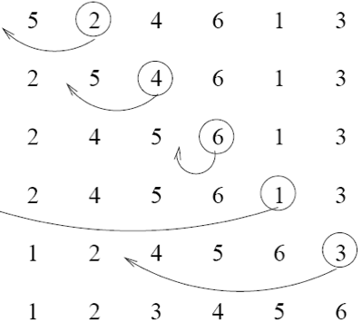
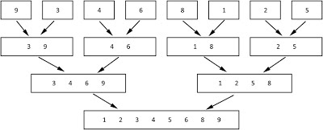

# Sorting Algorithms - part 1

**where sorting algorithms help us**

* 사람들을 정렬할 때 - Sorting a list of people
* 중간값을 찾을 때 - Find the median
* 중복을 제거할 때 - Find duplicates in some date
* 이진탐색 

**왜 공부하는가?**

* 정렬에 따른 성능의 차이 - 성능제약에 맞추기 위해서다.
* 큰 자료나 적은 자료냐 상황에 따라서 달라질 수 있다.
* Stable - 안정적인 

**차이를 비교하고 이해해야 한다. **

### What does "stable" mean?

- 상대적인 그 위치를 최종결과에서 유지 되는가 ? 
  - 같은 값이 있을때 처음의 상대적 위치가 정렬된 순서랑 같이 위치하여 있는가
-  bubble sort, insertion sort, merge sort (selection sort 빼고)

### What does "in place" mean?

bubble sort, insertion sort, selection sort (merge sort 빼고)

<br>

## Bubble Sort


점진적으로 본인의 위치를 찾아간다. 위로 뽀글뽀글

1. 리스트가 있다. 
2. 한번 훑고 계속 훑는다. 왼 -> 오
3. 그 옆에있는애랑 비교하면서 자리를 바꿔나간다. 

**반복순회하면서 왼오를 바꿔간다.**

length - 1 만큼 순회한다. 그치만 장담할 수 없다. 

### Big O

| Worst Case |                                             | Best Case |                            |
| ---------- | ------------------------------------------- | --------- | -------------------------- |
| O(n**2)    | 한번 훑을때  전체를 훑고 총 횟수는 n번이다. | O(n)      | 모든게 다 정렬이 되어있다. |

한번더 순회해야하는지 순회를 끝내야하는지를 파악해야한다.

### 장점

* Memory: **"in place"** algorithm
  * In place - 리스트가 주어짐, 추가적인 다른 공간에 저장된 후 사용되는게 아니다. 추가적인 장소가 필요없다.
* 쉬운로직이다 - 면접질문에 많이 나온다.. 이것도 모르면 바보멍충이구나'ㅁ'
* 어떤리스트가 정렬이 되어있는지 안되어있는지 알 수 있다. 

### 단점

* 성능적으로 별로다 - 자료가 많은 경우

<br>

## Insertion Sort

* 오른쪽이 pick된다.
* 왼쪽 -> 오른쪽 진행하면서 오른쪽이 왼쪽보다 크면 끼어넣는다.
* 오른쪽이 더 크다면 pick이 된 수가 바뀐다.


왼쪽에 있는 애랑 비교한다. 



### Big O

| Worst Case |                                             | Best Case |                            |
| ---------- | ------------------------------------------- | --------- | -------------------------- |
| O(n**2)    | 한번 훑을때  전체를 훑고 총 횟수는 n번이다. | O(n)      | 모든게 다 정렬이 되어있다. |

### 장점

* **In place**

### 단점

* 성능적으로 별로다.

<br>

## Selection Sort


왼쪽 -> 오른쪽까지 배열이 있다.

왼쪽부터 보면서 본인의 위치를 바로 찾아서 넣는다. 0번째 인덱스 / 1번째 인덱스 

**자리를 기준으로 정렬한다.**

* 0번째 인덱스에 있어야하는애를 찾는다. 
* 1번째 인덱스를 찾는다. 
* 2번째 인덱스를 찾는다. 

### Big O

| Worst Case |                                                          | Best Case |                                                 |
| ---------- | -------------------------------------------------------- | --------- | ----------------------------------------------- |
| O(n**2)    | n만큼의 단계지만<br />한단계에 n만큼 돌아야하기 때문에.. | O(n**2)   | **자리를 기준으로 한다.**<br />상대적이지 않다. |

### Stable

* Stable 하지 않는다. 

```js
[5, 5, 1] // 	처음
[1, 5, 5] // 첫번째 5가 맨뒤로 갔다. stable 하지 않는다.
```


### 장점

* In place이다.

### 단점

* 퍼포먼스가 최악이다.

<br>

##  Merge Sort



합쳐나가는거 

* 개별적으로 자른다.
* 두개를 비교한다. 비교후 정렬한 후 통합한다. 
* 두개 + 두개를 합칠때 맨앞에 자리를 두개 비교 뒷자리 두개를 비교한다. 
* 네개 + 네개를 합칠때는 자리수로 또 비교한다.

### Big O

| Worst Case  |                                                              | Best Case   |                                                           |
| ----------- | ------------------------------------------------------------ | ----------- | --------------------------------------------------------- |
| O(n log(n)) | 한개가 반반 쪼개가면서 log n인데 <br />그 갯수가 n개 있기 때문에 n*log(n) | O(n log(n)) | 한개가 log n인데 <br />그 갯수가 n개 있기 때문에 n*log(n) |

칸아카데미 'ㅁ' 

### 장점

* 평균적으로 보장이 되어있다. 
* 자료가 많을 때 사용하기 좋다.

### 단점

* 한개가 하나의 배열이다. - in place로 할 수 없다. 공간적인 필요도가 o(n)
* 자료가 적을 때는 별로다.

### Divide and Conquer

* **Divide**: 최대한 세세하게 작은 문제로 쪼갠다. 
* **Conquer**: 재귀적으로 정렬한다.
* **Combine**
* **Quicksort**
* **BST**가 해당된다. 

[Divide and Conquer Algorithm Link](https://www.geeksforgeeks.org/divide-and-conquer-algorithm-introduction/) 

<br>

### 추가

* quick Sort
* Divide and Conquer
* Dynamic Programming